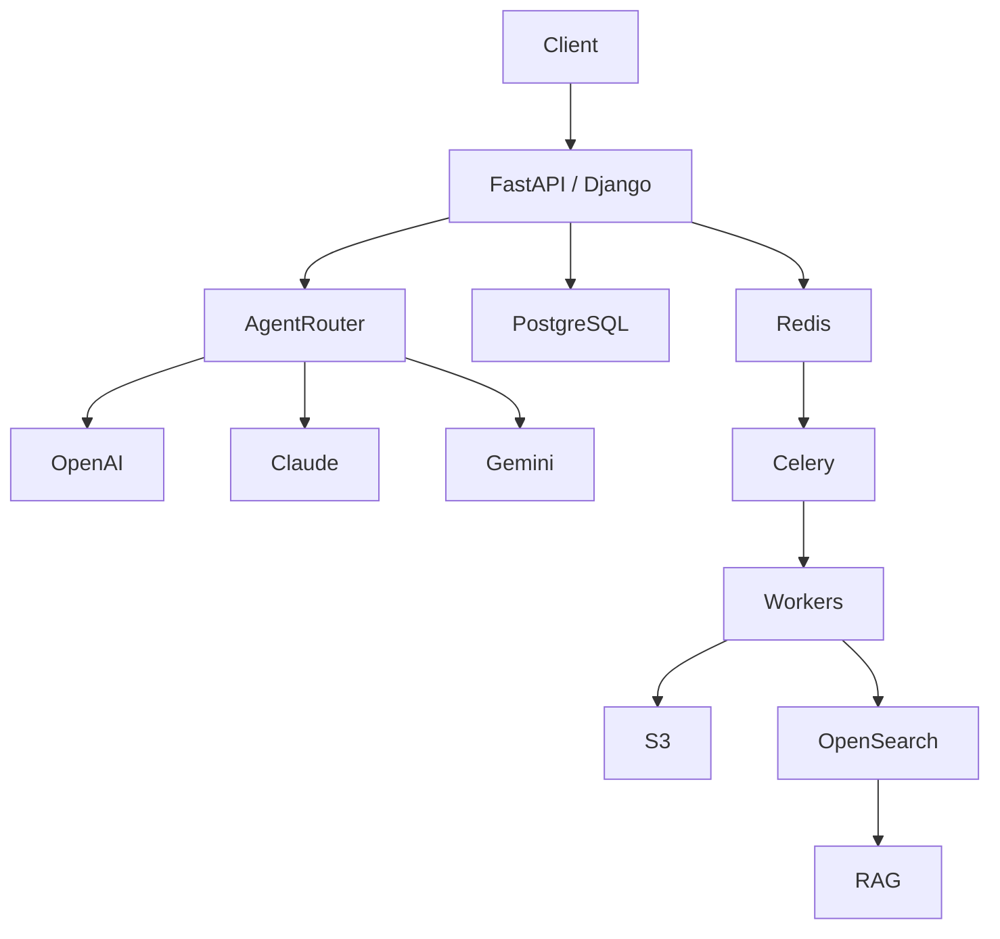

<div align="center">

# Khushi Chopra

### AI Systems Engineer • Backend Architect • Distributed Systems

Building production-grade AI systems, RAG infrastructure,
multi-agent workflows, and scalable backend platforms.

<p align="center">

</p>

</div>

---

## System Status

```json
{
  "role": "AI Systems Engineer",
  "specialization": [
    "RAG Systems",
    "Agentic Workflows",
    "Distributed Architecture",
    "Backend Engineering"
  ],
  "currently_building": [
    "Production AI Platforms",
    "Video Generation Systems",
    "Healthcare AI Infrastructure"
  ],
  "status": "Shipping"
}
```

---

# What I Do

I build systems that combine:

🧠 AI

⚡ Backend Engineering

🔄 Distributed Systems

☁️ Cloud Infrastructure

to create reliable products that survive production workloads.

My work focuses on:

- Retrieval-Augmented Generation (RAG)
- Multi-Agent Architectures
- Event-Driven Systems
- Async Processing Pipelines
- AI Workflow Orchestration
- LLM Reliability Engineering

---

# Architecture Mindset



---

# Core Technology Stack

## AI Systems


---

## Backend


---

## Distributed Systems


---

# Featured Systems

## AI Video Generation Platform

Production AI workflow powering:

- Script Generation
- Storyboarding
- Scene Planning
- AI Clip Creation
- Automated QA Scoring
- Brand Compliance
- Watermarking
- Export Pipelines

Stack:

`FastAPI` `Redis` `Celery` `PostgreSQL`
`Claude` `OpenAI` `Gemini`

---

## Multi-Agent Intelligence Platform

Designed an orchestration layer capable of:

- Agent Routing
- Persistent Memory
- Retrieval Workflows
- Context Management
- Analytics Agents
- Dynamic Tool Usage

Stack:

`LangChain`
`Redis`
`PostgreSQL`
`OpenSearch`

---

## Healthcare AI Infrastructure

Built AI workflows for:

- Medical OCR
- Clinical Document Parsing
- PHI-Aware Processing
- FHIR Conversion
- Async Data Pipelines

Stack:

`AWS Textract`
`Comprehend Medical`
`Kafka`
`Redis`
`AWS`

---

# Engineering Principles

```text
Build for production.
Measure everything.
Automate repetitive work.
Design for scale.
Prefer reliability over hype.
```

---

# Current Mission

Working on:

- Agentic AI Platforms
- Reliable RAG Infrastructure
- Distributed AI Systems
- High-Scale Backend Architectures
- Production LLM Workflows

---

# GitHub Analytics

<p align="center">


</p>

<p align="center">


</p>

---

# Connect

📧 khushichopra824@gmail.com

💼 LinkedIn

💻 GitHub

---

<div align="center">

### Building AI systems that are meant to run in production.

</div>
