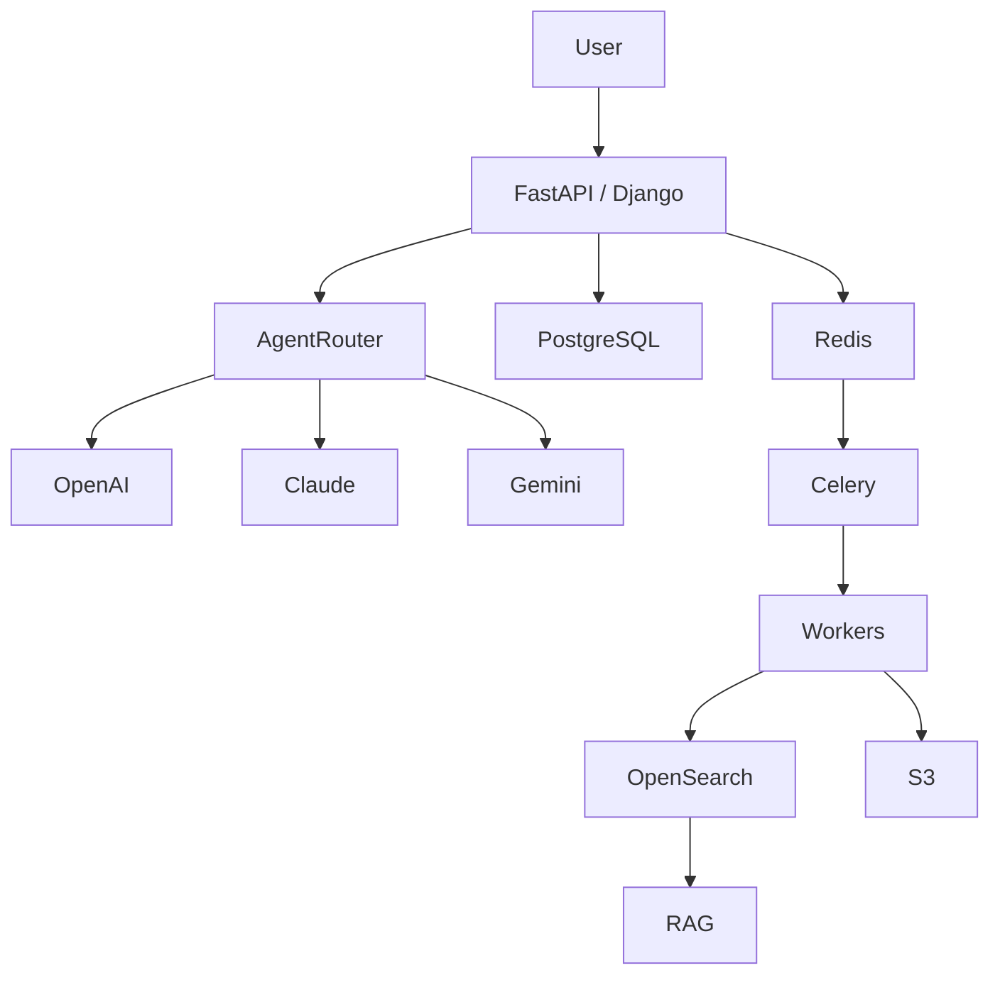

<div align="center">


<h1>AI Systems Engineer</h1>

<h3>
Building Production AI Systems • Multi-Agent Platforms • Distributed Infrastructure
</h3>


</div>

---

# /about_me

```yaml
name: Khushi Chopra

role:
  - AI Systems Engineer
  - Backend Engineer
  - Distributed Systems Builder

specialization:
  - Agentic AI Systems
  - Retrieval Augmented Generation
  - Distributed Infrastructure
  - Backend Engineering
  - LLM Reliability

currently_building:
  - Production AI Platforms
  - Multi-Agent Architectures
  - AI Video Generation Systems
  - Healthcare AI Infrastructure

philosophy:
  - Build for production
  - Reliability > hype
  - Automate repetitive work
  - Measure everything
  - Design for scale
```

---

# /architecture_dna



---

# /tech_radar

<table>
<tr>
<td width="33%" valign="top">

### 🧠 AI Systems


</td>

<td width="33%" valign="top">

### ⚡ Backend


</td>

<td width="33%" valign="top">

### 🚀 Infrastructure


</td>
</tr>
</table>

---

# /featured_systems

<table>

<tr>

<td width="50%">

## 🎬 AI VIDEO GENERATION

✓ Script Generation

✓ Storyboarding

✓ Scene Planning

✓ AI Clip Creation

✓ Quality Scoring

✓ Brand Alignment

✓ Watermarking

✓ Export Pipelines

### Stack

`FastAPI` `Redis` `Celery`

`PostgreSQL` `Claude`

`OpenAI` `Gemini`

</td>

<td width="50%">

## 🧠 MULTI-AGENT PLATFORM

✓ Agent Routing

✓ Memory Systems

✓ Tool Calling

✓ Analytics Agents

✓ Retrieval Pipelines

✓ Context Management

### Stack

`LangChain`

`Redis`

`PostgreSQL`

`OpenSearch`

</td>

</tr>

<tr>

<td width="50%">

## 🏥 HEALTHCARE AI

✓ Medical OCR

✓ Clinical Parsing

✓ PHI Processing

✓ FHIR Conversion

✓ Async Pipelines

### Stack

`Textract`

`Comprehend Medical`

`Kafka`

`Redis`

`AWS`

</td>

<td width="50%">

## 🛒 COMMERCE PLATFORM

✓ Product Discovery

✓ Inventory Engine

✓ Order Processing

✓ Authentication

✓ Background Jobs

### Stack

`FastAPI`

`PostgreSQL`

`Redis`

`Docker`

</td>

</tr>

</table>

---

# /engineering_dna

```text
AI SYSTEMS              ████████████████████ 95%
BACKEND ENGINEERING     ██████████████████░░ 92%
SYSTEM DESIGN           ██████████████████░░ 91%
DISTRIBUTED SYSTEMS     █████████████████░░░ 89%
CLOUD INFRASTRUCTURE    ████████████████░░░░ 85%
```

---

# /current_mission

```bash
> Building Agentic AI Platforms

> Designing Reliable RAG Infrastructure

> Scaling Distributed AI Systems

> Engineering LLM Evaluation Frameworks

> Shipping Production-Grade AI Workflows
```

---

# /github_analytics

<p align="center">


</p>

<p align="center">


</p>

<p align="center">


</p>

<p align="center">


</p>

---

# /connect

<div align="center">

📧 **khushichopra824@gmail.com**

💼 **LinkedIn**

💻 **GitHub**

🌐 **Open Source • AI Systems • Backend Engineering**

</div>

---

<div align="center">

### Building AI systems that are designed to survive production.


</div>
